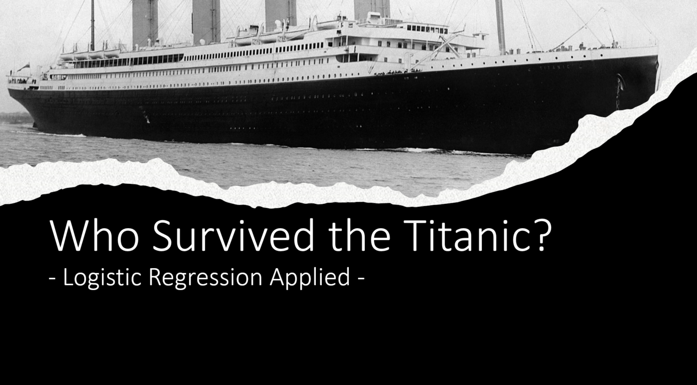

# Titanic App

This is the repository for a R shiny app that introduces the basics of the main interpretation steps of a logistic regression analysis. You can inspect the app on my [personal website](http://edgar-treischl.de/projects) or run the app via:

```{r, eval=FALSE}
library(shiny)
runGitHub("titanic-app", "edgar-treischl", ref="main")
```
 
 The app uses the classic example: Who survived the titanic? The app shows the main differences between linear and non-linear regression analysis and user explore how passenger's sex, class, and age effects who survived the Titanic.
 
 <center>

</center>
 
